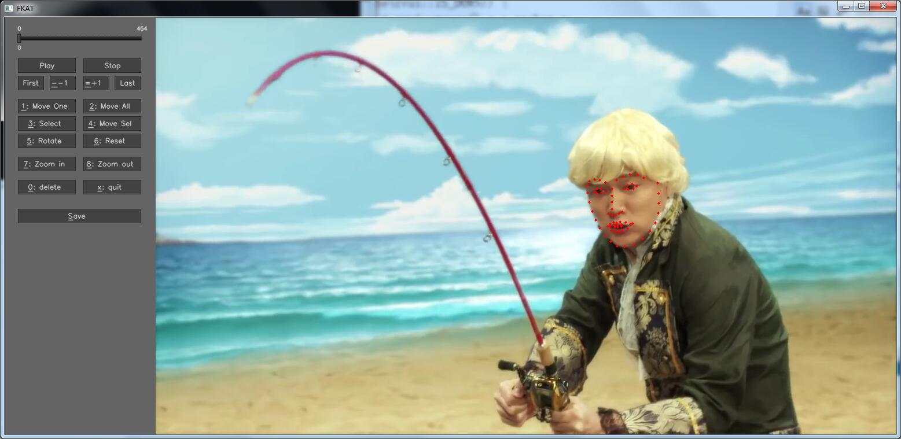

# FKAT: Facial-Keypoints-Annotation-Tool

A simple, single file GUI tool for facial keypoints annotation in video.

> Right now, it is heavily under development.

## Usage

### Basic

Coming soon...

### Keyboard shortcuts

Coming soon...

## Dependences

- [OpenCV](https://opencv.org/) 3.3.0 or later

## To do:
- [x] Upload source code.
- [ ] Complete functions.
- [ ] Detailed readme.